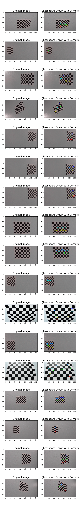
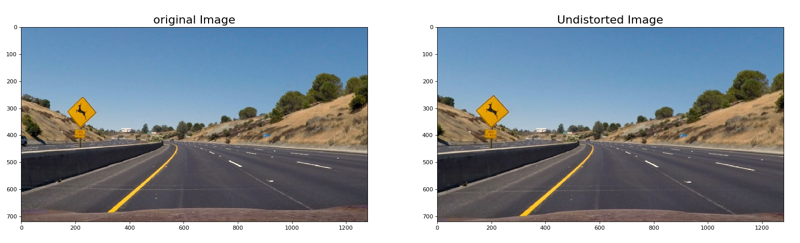
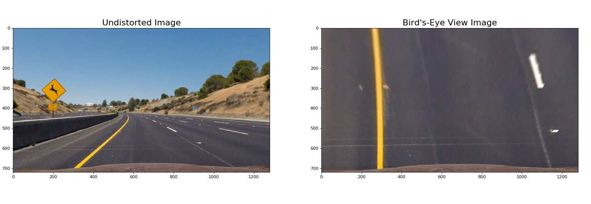
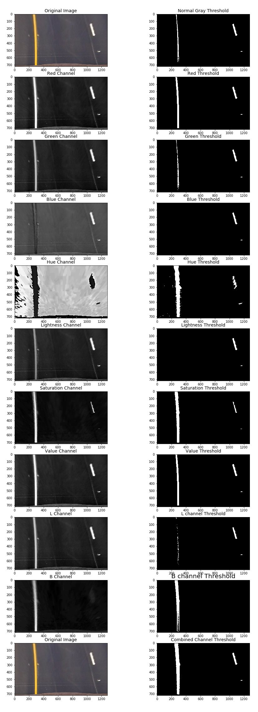
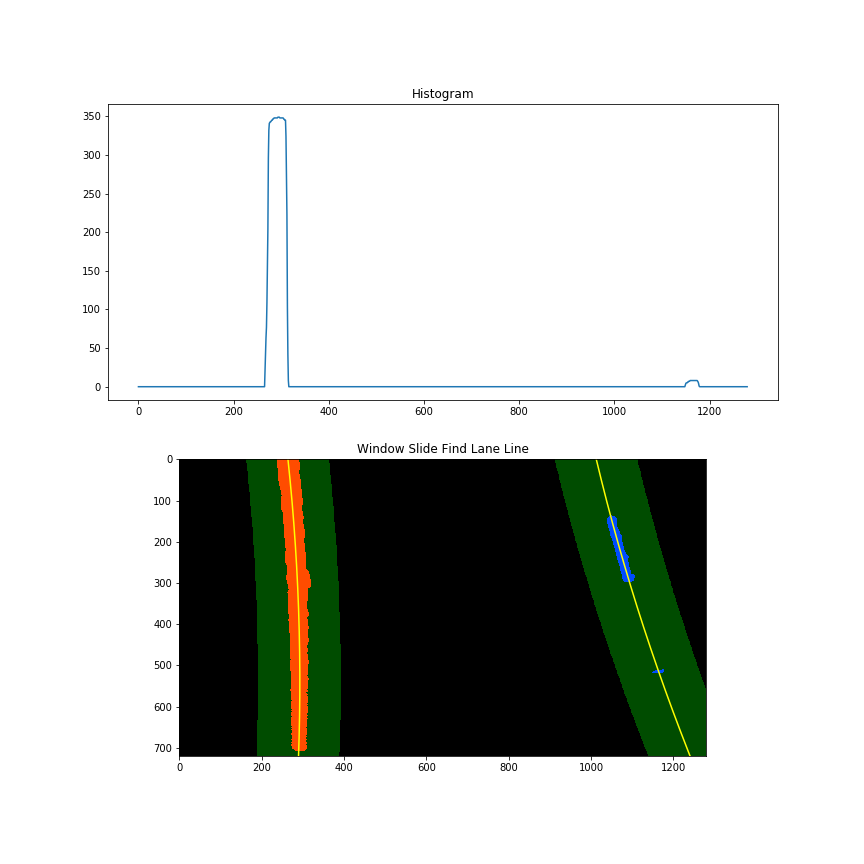
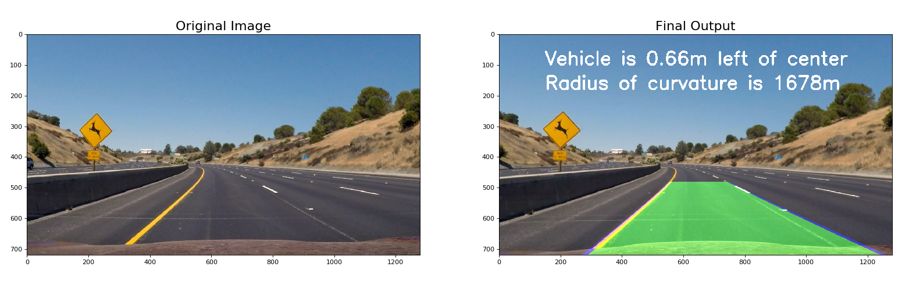
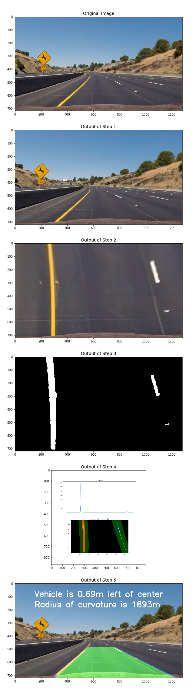

# Advanced Lane Finding Project

The goal of this project is to write a software pipeline to identify the lane boundaries in a video.

The steps implemented to achieve the goals set for this project are as follows:

1. Compute the camera calibration matrix and distortion coefficients given a set of chessboard images.
2. Apply a distortion correction to raw images.
3. Apply a perspective transform to rectify binary image i.e. ("get  a birds-eye view of the road").
4. Use color transforms, gradients, etc., to create a thresholded binary image.
5. Detect lane pixels and fit to find the lane boundary.
6. Determine the curvature of the lane and vehicle position with respect to center.
7. Warp the detected lane boundaries back onto the original image.
8. Output visual display of the lane boundaries and numerical estimation of lane curvature and vehicle position.

---

### Step - 1 Camera Calibration

The first step of the pipeline is to compute the camera calibration matrix and distortion coefficients given a set of chessboard images.

This was done by preparing "object points", which is the (x, y, z) coordinates of the chessboard corners in the specific world, with the assumtion that the chessboard is fixed on the (x, y) plane at z=0, such that the object points are the same for each calibration image.  Thus, `objp` is just a replicated array of coordinates, and `objpoints` will be appended with a copy of it every time all chessboard corners in a test image is successfully detected.  `imgpoints` will be appended with the (x, y) pixel position of each of the corners in the image plane with each successful chessboard detection.

In the next step I used the output `objpoints` and `imgpoints` to compute the camera calibration and distortion coefficients using the `cv2.calibrateCamera()` function.



---

### Step - 2 Undistort Image

The next step of the pipeline I used the distortion coefficients and camera calibrations computed in the previous step to remove any distortion from the image and returns the undistorted image as a result using the function `  cv2.undistort()`.



---

### Step - 3 Perspective Transform (Bird's-Eye View)

This step involves transforming the undistorted image returned from the prvious step of the pipeline to a "birds eye view" perspective of the road which focuses only on the lane lines and makes the lane lines appear to be relatively parallel to one another as opposed to appearing to be converging with one another. The advantage of this is that it would help make it easier to fit polynomials to the lane lines and measure the curvature in the later steps ofthe pipeline.

The code for my perspective transform includes a function called `perspective_transform()`. This function takes as inputs an image `img`, and returns the `warped` image as a result.

 I chose the hardcode the source and destination points as follows:

| Source        | Destination   |
|:-------------:|:-------------:|
| 490,482       | 0, 0        |
| 810, 482      | 1280, 0      |
| 1250, 720     | 1250, 720      |
| 40, 720       | 40, 720        |

I verified that my perspective transform was working as expected by drawing the `src` and `dst` points onto a test image and its warped counterpart to verify that the lines appear parallel in the warped image.



---

### Step - 4 Apply Binary Thresholds to Images
This step of the pipeline involves converting the warped image of the road to different color spaces and create binary thresholded which elicits only the lane lines on the road and igonores everything else.


I used a combination of color channel thresholds to generate a binary image. Here's an example of my output for this step.



After testing various color channels and thresholds, the following did a good job in identifying the lane lines in the warped images.

1. The R channel from the RGB color space, with a min threshold of 200 and a max threshold of 255.It managed to identify both the white and yellow lane line.
2. The S channel from HLS color space, with a min threshold of 90 and max threshold of 255 managed to also identify both the white and yellow lane lines.
3. The L channel from the LUV color space, with a min threshold of 215 and a max threshold of 255 did a good job in picking out the white lane line, however it performed poorly when it came to picking out the yellow lane line.
4. The B channel from the LAB color space, with a min threshold of 155  and a max threshold of 200 , managed to identify the yellow lane line but ignored the white lane line.

I inturn created a combined binary threshold based on the above four mentioned binary thresholds, in order to create a combination thresholded image which is able to pick out both the white and yellow lane lines.

---

### Step - 5 Finding Lane Lines

The combined binary image, which is the output of the prvious step of the pipeline helps isolate only those pixels which belong to the lane lines.
This step in turn focuses on fitting a polynomial to each lane line by carrying out the following steps.

1. First step involves identifying peaks in the histogram of the image, in order to determine the location of the lane lines.
2. Next step is to use the function ```numpy.nonzero()``` to identify all the non-zero pixels around the histogram peaks.
3. Final step invloves fitting a polynominal to each of the lanes by using the function ```numpy.ployfit()```.

The output of the above mentioned steps is as follows.



---

### Measure Position of the Vehicle from the Center

Once the polynomial was fit to each of the lane line, the position of the vehicle with respect to the center was computed using the following calculations.

- Calculated the average of the x intercepts from each of the two polynomials, ```position =(rightx_int + leftx_int)/2```
- Calculated the distance of the vehicle from center by taking the absolute value of the vehicle position minus the halfway point along the horizontal axis ```distance_from_center = abs(image_width/2 - position)```
- If the horizontal position of the car was greater than ```image_width/2```, then the car was classified to be left of the center, else it was classified to be on the right of the center.
- The finally step of the computation involves converting the distance from the center from pixels to meters by multiplying the number of pixels by ```3.7/700```

```
def center_of_vehicle(left_fit,right_fit):
    leftx_int = left_fit[0]*720**2 + left_fit[1]*720 + left_fit[2]
    rightx_int = right_fit[0]*720**2 + right_fit[1]*720 + right_fit[2]
    # Calculate the position of the vehicle
    center = abs(640 - ((rightx_int+leftx_int)/2))
    return center

```
---

### Measure Curvature

The following function is used to calculate the radius of curvature for each lane in meters, and the final radius of curvature that is returned as an output is an average of the left and right lane line curve radius.

```
def measure_curvature(left_fit,right_fit,leftx,rightx,lefty,righty):
    # Define conversions in x and y from pixels space to meters
    ym_per_pix = 30/720 # meters per pixel in y dimension
    xm_per_pix = 3.7/700 # meters per pixel in x dimension
    ploty = np.linspace(0, 719, num=720)
    y_eval = np.max(ploty)

    leftx = leftx[::-1]  # Reverse to match top-to-bottom in y
    rightx = rightx[::-1]  # Reverse to match top-to-bottom in y

    #Measure Curvature in pixels
    left_curverad_px = ((1 + (2*left_fit[0]*y_eval + left_fit[1])**2)**1.5) / np.absolute(2*left_fit[0])
    right_curverad_px = ((1 + (2*right_fit[0]*y_eval + right_fit[1])**2)**1.5) / np.absolute(2*right_fit[0])

    # Fit new polynomials to x,y in world space
    left_fit_cr = np.polyfit(lefty*ym_per_pix, leftx*xm_per_pix, 2)
    right_fit_cr = np.polyfit(righty*ym_per_pix, rightx*xm_per_pix, 2)
    # Calculate the new radii of curvature
    left_curverad_m = ((1 + (2*left_fit_cr[0]*y_eval*ym_per_pix + left_fit_cr[1])**2)**1.5) / np.absolute(2*left_fit_cr[0])
    right_curverad_m = ((1 + (2*right_fit_cr[0]*y_eval*ym_per_pix + right_fit_cr[1])**2)**1.5) / np.absolute(2*right_fit_cr[0])


    return left_curverad_m,right_curverad_m,int((left_curverad_m + right_curverad_m)/2)
```
---

### Step - 6 Draw Lane Lines

The final step of the pipeline involves plotting the polynomials on to the warped image and then fill the space between the polynomials to highlight the lane in which the vehicle is in.Then use another perspective transformation to unwarp the image from the bird's-eye view perspective and also display in text on the top fold of the image, the position of the vehicle from the center and the average radius of curvature of the lane lines.

The final output can be seen in the following image.



---

### Advanced Lane Line Detector and Line Class

As the goal of the project was to process each frame of the video and to create as smooth and robust output of the detected lane lines. Therefore, I created  a class called ```Line```  and instantiated it for both the ```Right``` and ```Left``` lane lines.

The Line class in turn stores features of each of the lanes, so that their corresponding values can be averaged across every the frame.

The ```Pipeline``` function in the ```AdvanceLaneLineDetector``` class first checks whether or not the lane was detected in the previous frame. If the lane was detected in the previous frame, it in turn checks for lane pixels in close proximity to the polynomial calculated in the prvious frame. This in turn makes the pipeline more efficient as it does not need to scan the entire image again, and the pixels which were detected have a high probability of belonging to the lane line, as it was based on the location of the pixel locaion of the lane in the previous frame.

If however, the pipeline fails to detect the lane line in a current frame, based on the previous frame, only then will it perform a ```blind_search```, where it scans the entire binary image for non-zero pixels in order to represent the lane lines.

In order to achieve the goal of producing a smooth output, the coefficients of the polynomials for each of the lane line, were averaged over a span of 10 frames.

A visual output of each step of the ```pipeline``` function in the ```AdvanceLaneLineDetector()``` class is as follows:



---

### Process and Output Project Video

After designing the pipeline to process still images, the next step involved processing the video frame by frame as it would be like to process an image stream in real time on an actual self driving car.

- [Project Video](https://youtu.be/IlgAU-CNhLo "Project video output")
- [Challenge Video](https://youtu.be/C3KakSXJQ_s "Challenge video output")

---

### Conclusion

The pipeline developed did a robust job in detecting the lane lines distinctly in the project video, in an ideal road quality, lighting and whether conditions. The pipeline also did a fairly good job on the challenge video provided, with the exception of losing the lane lines momentarily due to the shadow that occured when the car drove under the overpass.

However, there are limitations to the pipeline, especially when the conditions are not ideal, such as a sharp turns, poor raod quality, cloudy or heavy rain weather conditions and when the lighting conditions are very bright. The challenging aspect is to find a certain set of image processing steps in the pipeline with fintuned parameters to work well in all conditions.

The pipeline may need to be dynamic in order to work well in any condition and this something that can be further looked into, in order to be able to identify the lane lines more robustly.

Video recordings of driving a car in different conditions can also be made in order to further test and improve the pipeline for detecting the lane lines more robustly.
